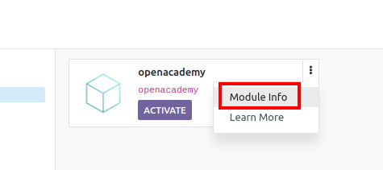
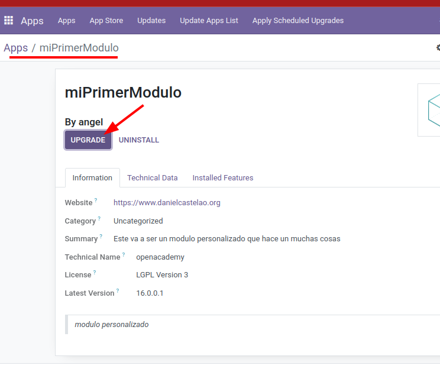
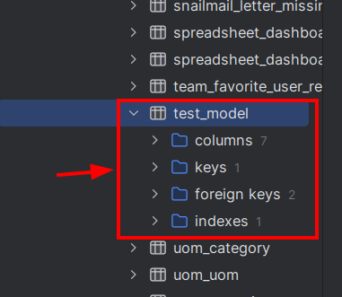
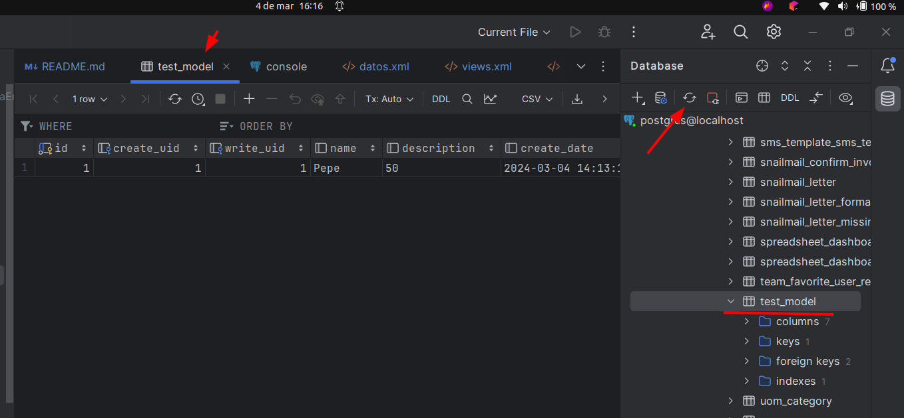
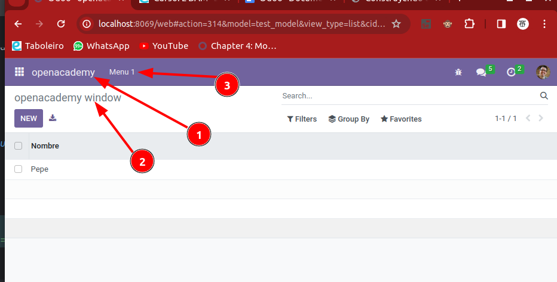
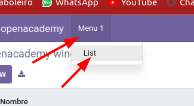
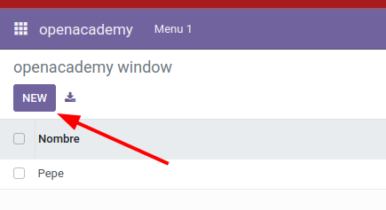
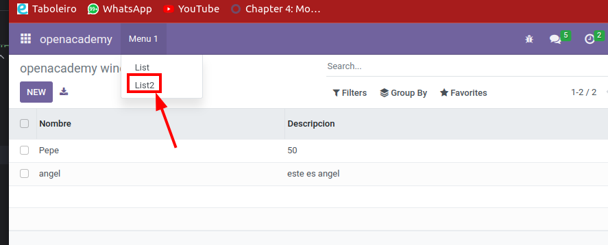
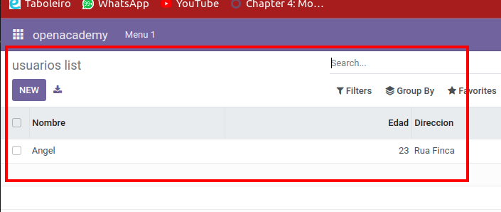
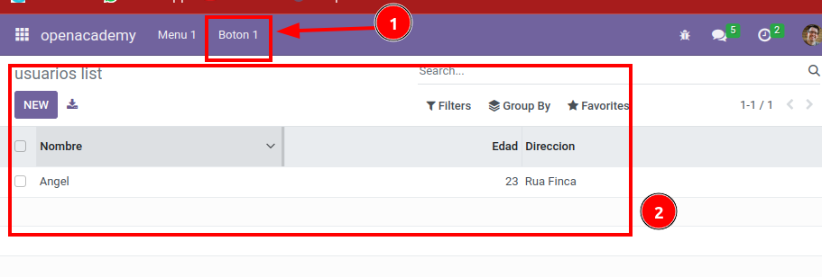

# Tarea: Entorno de desarrollo en Odoo y creación de módulo

_Enunciado ejercicio:_

* Docker con Odoo + PostgreSQL
* Acceso a la Base de Datos desde PyCharm
* Creación de tablas
* Edición de datos en formulario

Entrega repositorio con el módulo y un readme

------
------

## Docker con Odoo + PostgreSQL

### PostgreSQL :file_folder:

Creamos el docker compose. En mi caso tengo que desconectar
el servicio que esté utilizando el puerto 5432 para poder mapearlo
desde el compose.

```bash
# info del servicio que esta utilizando el puerto: PID, nombre servicio...
$ sudo lsof -i :5432
# mato el servicio que esté utilizando ese puerto
$ sudo kill PID_del_proceso
```
A continuación ya podría mapear los puertos `5432:5432` en el compose.

> Otra manera sería mapearlos hacia un puerto de mi host que no
> se esté utilizando como
> por ejemplo  `5234:5432`

Lanzamos los contenedores del servicio de base de datos y web 
con `docker compose up -d`.

A continuación nos conectamos desde PyCharm al contenedor de bd:


Rellenamos los campos del usuario y contraseña de la bd recurriendo
a las variables de entorno del docker compose.

### Odoo :globe_with_meridians:

Para comprobar que el servicio web esté funcionando buscamos
en el navegador `http://localhost:8069`. 

Cubrimos los datos del formulario y continuamos
`./credenciales.txt`.

Checkeamos la opcion de "Create Demo Data" para configuraciones
por defecto.

> [!WARNING]
>  En el apartado Database Name tendras que poner otro 
> nombre que no sea el de la base de datos de postgres 
> del docker compose, ya que si no te dara un error.

Comprobamos que se ha creado la nueva base de datos en el IDE:


----
----

## Módulos

### Contenido del módulo  :briefcase:

Ficheros **fundamentales**:

#### a. `__manifest__.py` 

El fichero
[manifiesto](https://vauxoo.github.io/odoo/reference/module.html#reference-module-manifest). Este fichero
contiene un único diccionario de Python 
en donde cada key especifica un metadato
del módulo.

#### b. `__init__.py`

Contiene instrucciones de importación de varios archivos 
de Python en dicho módulo.

Por ejemplo, si un módulo tiene un solo archivo `mymodule.py`
, el archivo `__init__.py` podría contener

```python
from . import mymodule
```

### Creación módulo :new:

En el contenedor web de Odoo creamos un nuevo módulo.

```bash
# entramos en la terminal del contenedor odoo
# tenemos que entrar como root ya que si no no nos deja hacer
# cambios en los directorios
$ docker exec -u root -it tareaentornoymodulo-web-1 /bin/bash

# nos dirigimos a la carpeta de las addons
$ cd /mnt/extra-addons/

# creamos modulo
$ odoo scaffold openacademy/

# modificamos permisos para poder modificar el modulo
# asi tambien podremos editar archivos desde el host con el IDE
$ chmod -R 777 openacademy/
```
> `scaffold` crea un montón de archivos estándar para dicho módulo.
> La mayoría de ellos contienen sólo código comentado o XML.

Ahora le tenemos que decir a odoo que voy a crear una carpeta
de addons donde iré poniendo mis addons customizados.

```bash
# creamos el fichero odoo.conf en es ubica
$ nano /etc/odoo/odoo.conf
# añadimos lo siguiente:
[options]
addons_path=/mnt/extra-addons # ubica dd guardaromos los custom addons

# comprobamos
$ cat /etc/odoo/odoo.conf 
[options]
addons_path=/mnt/extra-addons
```

Salimos de los contenedores y los reiniciamos con `restart`.

Para comprobar que se han realizado los cambios introducimos
`$ docker logs tareaentornoymodulo-web-1` en el bash y si 
nos aparece la siguiente linea esque lo hemos hecho correctemente:


> Esa linea indica que se ha añadido esa ubicación señadala
> a las ubicaciones donde están los addons. En mi caso, si no
> hacía este último proceso, no me aparecería el addon custom
> cuando lo buscaba en odoo.

Comprobación :white_check_mark:

1. Entramos en la web de odoo
2. Nos pasamos a modo desarrollador mediante:
   1. Activando cualquier app para que nos aparezca el menu de 
   _Setting -> general settings -> Activate the developer mode_
   2. Añadiendo extensión "Odoo Debug" en navegador.
   3. En la url añadir `?debug=1` en http://localhost:8069/web?debug=1#...
3. Actualizamos lista apps: _Apps -> Update App List_ 
4. En el buscador de odoo buscamos el nombre de nuestra app.


### Modificación del módulo :memo:

Vamos a modificar los metadatos del modulo, que podemos
encontrar en:



Las siguientes modificaciones del código ya 
las podemos hacer directamente desde mi máquina HOST
con el IDE, ya que dimos todos los permisos previamente
`$ chmod -R 777 openacademy/`

Para modificar los metadatos nos dirigimos a `__manifest__.py`:

```python
 'name': "miPrimerModulo",

 'summary': """
     Este va a ser un modulo personalizado que hace un muchas cosas""",

 'description': """
     modulo personalizado
 """,

 'author': "angel",
 'website': "https://www.danielcastelao.org",
```

>[!WARNING]
> Cada vez que hagamos un cambio en el addon (como este) hay que 
> reiniciar los contenedores `$ docker restart tareaentornoymodulo-web-1 tareaentornoymodulo-db-1`
> y **actualizar el modulo**

:rotating_light: Para actualizar el modulo (dentro de
module info):



### :one: Modelos/Tablas - Tabla 1 con menú 

Creación de nuestra primera tabla/model en Odoo

#### 1. Creación tabla

Nos dirigimos a `models/models.py` y creamos la tabla

```python
from odoo import fields, models

class TestModel(models.Model):
    _name = "test_model"
    _description = "Modelo de prueba"

    name = fields.Char(string="Nombre")
    description = fields.Text(string="Descripcion")
```

Reiniciamos contenedores + actualizamos módulo

Comprobación: :white_check_mark:

En la siguiente ubicación deberíamos encontrar la nueva tabla creada con
el nombre "test_model".




#### 2. Inserción datos

La tabla se crea sin datos por defecto. Para añadirlos:

Los datos del módulo son declarados vía Archivos de Datos,
archivos XML con elementos `<record>`. Cada elemento
`<record>` crea o actualiza registros en la bd.

Creamos `/extra-addons/openacademy/data/datos.xml` y pegamos:

```xml
<odoo>
    <data>
        <!--
        test_model: nombre de la tabla de model,
        id: no le voy a hacer ref, le puedo poner nombre que quiera
        -->
        <record model="test_model" id="openacademy.nombres">
            <!--
            *CAMPOS QUE TIENE LA TABLA*
            "name" y "description" hacen ref a los elementos
            que hemos puesto en el model
            -->
            <field name="name">Pepe</field> <!-- El nombre debe ser el mismo que la variable del modelo -->
            <field name="description">50</field> <!--El nombre debe ser el mismo que la variable del modelo-->
        </record>
    </data>
</odoo>
```

Añadimos el archivo al `__manifest__.py` para que puedan
cargarse estos datos, estos pueden ir cargados en las listas:
* `'data'` = siempre se carga.
* `'demo'` = se cargará solo cd el modo demostración esté habilitado.

```xml
'data': [
  ...,
  'data/datos.xml',
],
```

Reiniciamos contenedores + actualizamos modulo:

Comprobación: :white_check_mark:



#### 3. Visualización en Odoo

La creación de la tabla **no significa la visualización** de 
la misma en la web de odoo. Para mostrarlas tenemos que recurrir
a acciones y menús.

Las acciones y los menús son registros regulares en la bd, usualmente
a traves de archivos de datos. Las acciones pueden ser disparadas de 3 formas:

* Haciendo click en los menús (enlazados a una accion específica).
* Haciendo click en los botones en las vistas (si estos están conectados a acciones).
* Como acciones contextuales en el objeto.

Ya que los menús son complejos de declarar, hay un acceso directo 
`<menuitem>` para declarar un `ir.ui.menu` y así enlazarlo con mayor 
facilidad a la acción correspondiente.

Para esto nos dirigimos al archivo `views/views.xml`.

```xml
<odoo>
   <data>
      
    <!-- explicit list view definition -->
    <record model="ir.ui.view" id="openacademy.list1">
      <field name="name">openacademy list</field>
      <field name="model">test_model</field>
      <field name="arch" type="xml">
        <tree>
          <field name="name"/>
          <field name="description"/>
        </tree>
      </field>
    </record>
      
      <!-- actions opening views on models -->
      <!-- debe declararse ANTES de declararse el menu correspondiente -->
      <!-- los archivos de datos se ejecutar secuencialmente 
      por lo que el id de la accion debe estar presente en la bd ANTES de que 
      se pueda crear el menu -->
       <record model="ir.actions.act_window" id="openacademy.action_window">
         <field name="name">openacademy window</field>
         <!-- Nombre de la tabla, antiguamente ponia: openacademy.openacademy,
         que es el nombre que tambien hay que cambiar en el security -->
         <field name="res_model">test_model</field>
         <field name="view_mode">tree,form</field>
       </record>
      
      <!-- Top menu item -->
       <menuitem name="openacademy" id="openacademy.menu_root"/>
      
       <!-- menu categories -->
       <menuitem name="Menu 1" id="openacademy.menu_1" parent="openacademy.menu_root"/>
       <!--<menuitem name="Menu 2" id="openacademy.menu_2" parent="openacademy.menu_root"/>-->
      
       <!-- actions -->
       <menuitem name="List" id="openacademy.menu_1_list" parent="openacademy.menu_1"
                 action="openacademy.action_window"/>
   </data>
</odoo>
```

Para visualizar tabla descomentar el apartado de `'security...'` en `__manifest__.py`:

```python
'data': [
  'security/ir.model.access.csv',
  'views/views.xml',
  'views/templates.xml',
  'data/datos.xml',
],
```

Para acceder a este archivo, nos ubicamos en `/security/ir.model.access.csv`
y modificamos nombre del modelo y grupo al que pertenece:

_Antiguamente: "openacademy.openacademy"_


> No se ha modificado el grupo al que pertenece, pq?

Reiniciamos contenedores + actualizamos módulo

Comprobación :white_check_mark:

A. Menú "openacademy"


En `views.xml`:
```xml
<!-- Top menu item -->
<menuitem name="openacademy" id="openacademy.menu_root"/>
```

B. Dentro del modulo



En `views.xml`:
```xml
<!-- actions opening views on models -->
<record model="ir.actions.act_window" id="openacademy.action_window">
   <field name="name">openacademy window</field> <!-- 2 -->
   <field name="res_model">test_model</field>
   <field name="view_mode">tree,form</field>
</record>

<!-- Top menu item -->
<menuitem name="openacademy" id="openacademy.menu_root"/> <!-- 1 -->

<!-- menu categories -->
<menuitem name="Menu 1" id="openacademy.menu_1" parent="openacademy.menu_root"/> <!-- 3 -->
```

C. Tablas

Como sólo hay una tabla nos la muestra directamente, pero si tuvieramos
varias, tendríamos que escoger cual queremos que nos muestre en:



En `views.xml`:
```xml    
<!-- actions -->
<menuitem name="List" id="openacademy.menu_1_list" parent="openacademy.menu_1"
        action="openacademy.action_window"/>
```

#### 4. Modificación datos desde Odoo



Rellenamos datos y le volvemos a dar al "New" de arriba a la derecha


Comprobamos en la bd de Postgres:


----

### :two: Modelos/Tablas - Tabla 2 con menú

Creación de nuestra segunda tabla/model en Odoo

#### 1. Creación tabla

> Buena práctica: por cada tabla una clase distinta. Hay que
> importarlas en el `__init__` del paquete.

Dentro del paquete `models` deberíamos cambiamos el nombre 
del fichero `models.py` a `tabla1.py` (pero esto no lo vamos a hacer)
y creamos un nuevo
fichero en esa ubicación que se llame `usuario.py`.

```python
from odoo import fields, models

class TestModel(models.Model):
    _name = "usuarios"
    _description = "Tabla que que recopila los usuarios de la app"

    name = fields.Char(string="Nombre")
    edad = fields.Integer(string="Edad")
    direccion = fields.Text(string="Direccion")
```

En el `__init__`:

```python
from . import models, usuario
```

Reiniciamos contenedores + actualizamos módulo.

Revisamos en postgres que se ha creado una
nueva tabla.

#### 2. Inserción datos

Creamos un nuevo fichero `/data/usuario.xml`

```xml
<odoo>
    <data>
        <record model="usuarios" id="openacademy.usuarios">
            <field name="name">Angel</field>
            <field name="edad">23</field>
            <field name="direccion">Rua Finca</field>
        </record>
    </data>
</odoo>
```

En el `__manifest__.py`:

```python
 'data': [
     'security/ir.model.access.csv',
     'views/views.xml',
     'views/templates.xml',
     'data/datos.xml',
     'data/usuario.xml',
 ],
```

#### 3. Visualización en Odoo

```xml
<odoo>
  <data>
    <!-- explicit list view definition -->
    <record model="ir.ui.view" id="openacademy.list1">
      <field name="name">openacademy list</field>
      <field name="model">test_model</field>
      <field name="arch" type="xml">
        <tree>
          <field name="name"/>
          <field name="description"/>
        </tree>
      </field>
    </record>

    <record model="ir.ui.view" id="openacademy.list2">
      <field name="name">usuarios list</field>
      <field name="model">usuarios</field>
      <field name="arch" type="xml">
        <tree>
          <field name="name"/>
          <field name="edad"/>
          <field name="direccion"/>
        </tree>
      </field>
    </record>

     
    <record model="ir.actions.act_window" id="openacademy.action_window">
      <field name="name">openacademy window</field>
      <field name="res_model">test_model</field>
      <field name="view_mode">tree,form</field>
    </record>

    <record model="ir.actions.act_window" id="openacademy.action_window2">
      <field name="name">usuarios list</field>
      <field name="res_model">usuarios</field>
      <field name="view_mode">tree,form</field>
    </record>

    <!-- Top menu item -->
    <menuitem name="openacademy" id="openacademy.menu_root"/>

    <!-- menu categories -->
    <menuitem name="Menu 1" id="openacademy.menu_1" parent="openacademy.menu_root"/>
    <!--
    <menuitem name="Menu 2" id="openacademy.menu_2" parent="openacademy.menu_root"/>
    -->

    <!-- actions -->
    <menuitem name="List" id="openacademy.menu_1_list" parent="openacademy.menu_1"
              action="openacademy.action_window"/>

    <menuitem name="List2" id="openacademy.menu_1_list2" parent="openacademy.menu_1"
              action="openacademy.action_window2"/>
     
  </data>
</odoo>
```

:rotating_light: Añadir en `security/ir.model.access.csv`:


Comprobacion :white_check_mark:





----

### :three: Modelos/tablas - Tabla 2 con botón

Mostrar la tabla pero ahora en vez de con 
menús, mostrarla al presionar un botón.

Para esto sólo tenemos que agregar en 
`views/views.xml`:

```xml
<!-- creamos un boton -->
<!-- cd yo pulso el bton con el action me va a mostrar directamente la tabla -->
<menuitem name="Boton 1" id="openacademy.boton_1" parent="openacademy.menu_root" action="openacademy.action_window2" />
```

Cuando le damos al botón se mostrará la tabla
de usuarios ya que viene identificada con 
`id="openacademy.action_window2"`

Comprobacion :white_check_mark:



