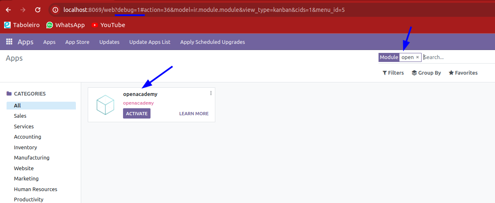

# Tarea: Entorno de desarrollo en Odoo y creación de módulo

* Docker con Odoo + PostgreSQL
* Acceso a la Base de Datos desde PyCharm
* Creación de tablas
* Edición de datos en formulario

Entrega repositorio con el módulo y un readme

## Docker con Odoo + PostgreSQL

### PostgreSQL

Creamos el docker compose. En mi caso tengo que desconectar
el servicio que esté utilizando el puerto 5432 para poder mapearlo
desde el compose.

```bash
# info del servicio que esta utilizando el puerto: PID, nombre servicio...
$ sudo lsof -i :5432
# mato el servicio que esté utilizando ese puerto
sudo kill PID_del_proceso
```
A continuación ya podría mapear los puertos `5432:5432` en el compose.

> Otra manera sería mapearlos hacia un puerto de mi host que no
> se esté utilizando como
> por ejemplo  `5234:5432`

Lanzamos los contenedores del servicio de base de datos y web 
con `docker compose up -d`.

#### Conexión db - PyCharm

Nos conectamos desde PyCharm al contenedor de bd:


Rellenamos los campos del usuario y contraseña de la bd recurriendo
a las variables de entorno del docker compose.

### Odoo

Para comprobar que el servicio web esté funcionando buscamos
en el navegador `http://localhost:8069`. 

Cubrimos los datos del formulario y continuamos (las credenciales
importantes están en este ubicación en un fichero llamado "credenciales.txt").

Checkeamos la opcion de "Create Demo Data" para configuraciones
por defecto

> [!WARNING]
>  En el apartado Database Name tendras que poner otro 
> nombre que no sea el de la base de datos de postgres 
> del docker compose, ya que si no te dara un error.

Comprobamos que se ha creado la nueva base de datos en el IDE:


## Módulos

### Contenido del módulo

#### `__manifest__.py`

El fichero
[manifiesto](https://vauxoo.github.io/odoo/reference/module.html#reference-module-manifest). Este fichero se sitúa
contiene un único diccionario de Python 
en donde cada key especifica un metadato
del módulo.

#### `__init__.py`

Contiene instrucciones de importación de varios archivos 
de Python en dicho módulo.

Por ejemplo, si un módulo tiene un solo archivo `mymodule.py`
, el archivo `__init__.py` podría contener

```python
from . import mymodule
```

----

### Creación módulo

En el contenedor web de Odoo creamos un nuevo módulo.

```bash
# entramos en la terminal del contenedor odoo
# tenemos que entrar como root ya que si no no nos deja hacer
# cambios en los directorios
$ docker exec -u root -it tareaentornoymodulo-web-1 /bin/bash

# nos dirigimos a la carpeta de las addons
$ cd /mnt/extra-addons/

# creamos modulo
$ odoo scaffold openacademy/

# modificamos permisos para poder modificar el modulo
# asi tambien podremos editar archivos desde el host con el IDE
$ chmod -R 777 openacademy/
```
> `scaffold` crea un montón de archivos estándar para dicho módulo.
> La mayoría de ellos contienen sólo código comentado o XML.

Ahora le tenemos que decir a odoo que voy a crear una carpeta
de addons donde iré poniendo mis addons custom.

```bash
# creamos el fichero odoo.conf en es ubica
$ nano /etc/odoo/odoo.conf
# añadimos lo siguiente:
[options]
addons_path=/mnt/extra-addons # ubica dd guardaromos los custom addons

# comprobamos
$ cat /etc/odoo/odoo.conf 
[options]
addons_path=/mnt/extra-addons
```

Salimos de los contenedores y los reiniciamos con `restart`.

Para comprobar que se han realizado los cambios introducimos
`$ docker logs tareaentornoymodulo-web-1` en el bash y si 
nos aparece la siguiente linea esque lo hemos hecho correctemente:


> Esa linea indica que se ha añadido esa ubicación señadala
> a las ubicaciones donde están los addons. En mi caso, si no
> hacía este último proceso, no me aparecería el addon custom
> cuando lo buscaba en odoo.

**Comprobación**

1. Entramos en la web de odoo
2. Instalamos el modo desarrollador con assets
   1. Activando cualquier app para que nos apaezca el menu de 
   _Setting -> general settings -> Activate the developer mode (with tests assets)_
   2. Añadiendo extensión Odoo Debug en navegador.
   3. En la url añadir `?debug=1` en http://localhost:8069/web?debug=1#...
3. Actualizamos lista apps: _App -> Update App List_ 
4. En el buscador de odoo buscamos el nombre de nuestra app.



### Modificación del módulo

> Las siguientes modificaciones del código ya 
> las podemos hacer directamente desde mi máquina HOST
> con el IDE, ya que dimos todos los permisos previamente
> `$ chmod -R 777 openacademy/`


Para modificar los metadatos nos dirigimos a `__manifest__.py`:

```python
 'name': "miPrimerModulo",

 'summary': """
     Este va a ser un modulo personalizado que hace un muchas cosas""",

 'description': """
     modulo personalizado
 """,

 'author': "angel",
 'website': "https://www.danielcastelao.org",
```

>[!WARNING]
> Cada vez que hagamos un cambio en el addon hay que 
> reiniciar los contenedores `$ docker restart tareaentornoymodulo-web-1 tareaentornoymodulo-db-1`
> y actualizar la lista de app en el odoo.

### Creación de modelo o tabla

Nos dirigimos a `models/models.py` y creamos la tabla

```python
from odoo import fields, models

class TestModel(models.Model):
    _name = "test_model"
    _description = "Modelo de prueba"

    name = fields.Char(string="Nombre")
    description = fields.Text(string="Descripcion")
```

#### Datos tabla

Los datos del módulo son declarados vía Archivos de Datos,
archivos XML con elementos `<record>`. Cada elemento
`<record>` crea o actualiza registros en la bd.

Creamos `/extra-addons/openacademy/data/datos.xml` y pegamos:

```xml
<odoo>
    <data>
        <record model="test_model" id="openacademy.nombres">
            <field name="name">Pepe</field> <!-- El nombre debe ser el mismo que la variable del modelo -->
            <field name="description">50</field> <!--El nombre debe ser el mismo que la variable del modelo-->
        </record>
    </data>
</odoo>
```

Añadimos el archivo al `__manifest__.py`:

```xml
'data': [
  ...,
  'data/datos.xml',
],
```

Reiniciamos mas contenedores y actualizamos las app de odoo
y veriamos los datos en la tabla


